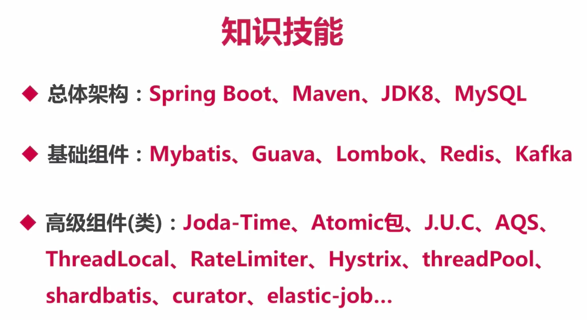

# 第1章 课程准备

## 1.2 课程导学

### 1.2.1 高并发解决思路与手段

+ 扩容
+ 缓存
+ 队列
+ 拆分
+ 服务降级与熔断
+ 数据库切库
+ 分库分表等

### 1.2.2 课程的核心讲解与核心知识准备

### 1.2.3 并发编程的线程安全处理

### 1.2.4 高并发处理的思路和手段

## 1.3 并发编程初体验

> 代码见[Chapter01Start](src/main/java/com/huawei/l00379880/mythread/Chapter01Start)

### 1.3.1 计数器功能

[代码实现](src/main/java/com/huawei/l00379880/mythread/Chapter01Start/CountExample.java)

### 1.3.2 计数器的Map实现

[代码实现](src/main/java/com/huawei/l00379880/mythread/Chapter01Start/MapExample.java)

## 1.4 并发与高并发的基本概念

### 并发

> 同时拥有两个或者多个线程，如果程序在单核处理器上运行，多个线程将交替地换入或者换出内存，这些线程是同时"存在"地，每个线程都将处于执行过程中的某个状态，如果运行在多核处理器上，此时，程序中的每个线程都将分配到一个处理器核上，因此可以同时运行

### 高并发

> 高并发(High Concurrency)是互联网分布式系统结构设计中必须考虑的因素，它通常是指，通过设计保证系统能够`同时并行处理`很多请求

### 并发与高并发

+ 并发：多个线程操作相同的资源，保证线程安全，合理使用资源
+ 高并发：服务能同时处理很多请求，提高程序性能

### 课程涉及的技术栈

## 1.5 JAVA内存模型 Java Memory Model JMM

### heap（堆）

> 运行时的数据区，是由垃圾回收负责,对象和创建和回收都在这里；

+ 优点：可以动态分配内存大小，生存期也不必事先告诉编译器，运行时动态分配内存，垃圾回收器会在不需要使用这些内存时，回收掉；
+ 缺点：因为时运行时动态分配内存，所以存储速度相对慢一些；

### stack（栈）

> 栈内存储基本类型变量，列入：小写的int，char......

+ 优点：存储速度比堆快，仅次于计算机的寄存器，栈的内存是可以共享的；
+ 缺点：存在栈内的数据大小与生存期必须是确定的，缺乏灵活性；

### Java内存模型抽象结构图

+ 线程A和线程B要进行通信必须要用主内存作为中转；
+ 每个线程并不能修改主内存中的共享变量，而只是有一份共享变量的副本

### 同步操作与规则

> 这里的工作内存就是上面图中的本地内存

+ 4对8种同步操作
  + 锁
    + `lock` (锁定):作用于主内存的变量,把一个变量标识为一条线程独占状态
    + `unlock` (解锁):作用于主内存的变量,把一个处于锁定状态的变量释放出来,释放后的变量才可以被其他线程锁定
  + 读写 
    + `read` (读取):作用于主内存的变量,把一个变量值从主内存传输到线程的工作内存中,以便随后的load动作使用write的操作 
    + `write` (写入):作用于主内存的变量,它把store操作从工作内存中一个变量的值传送到主内存的变量中
  + 加载与存储
    + `load` (载入):作用于工作内存的变量,它把read操作从主内存中得到的变量值放入工作内存的变量副本中
    + `store` (存储):作用于工作内存的变量,把工作内存中的一个变量的值传送到主内存中,以便随后的write操作
  + 值操作
    + `use` (使用):作用于工作内存的变量,把工作内存中的一个变量值传递给执行引擎
    + `assign` (赋值):作用于工作内存的变量,它把一个从执行引擎接收到的值赋值给工作内存的变量
    
+ 9个同步规则
  + 如果要把一个变量从主内存中复制到工作内存,就需要按顺寻地执行read和load操作,如果把变量从工作内存中同步回主内存中，就要按顺序地执行store和write操作。但Java内存模型只要求上述操作必须按顺序执行，而没有要求必须是连续执行
  + 不允许read和load 、store和write操作之一单独出现
  + 不允许一个线程丢弃它最近的assign的操作，即变量在工作内存中改变了之后必须同步到主内存中 
  + 不允许一个线程无原因地(没有发生过任何assign操作)把数据从工作内存同步回主内存中
  + 一个新的变量只能在主内存中诞生，不允许在工作内存中直接使用一个未被初始化(load或assign)的变量。即对一个变量实施use和store操作之前，必须先执行过了assign和load操作
  + 一个变量在同一时刻只允许一条线程对其进行lock操作，但lock操作可以被同一条线程重复执行多次，多次执行lock后，只有执行相同次数的unlock操作，变量才会被解锁。lock和unlock必须成对出现
  + 如果对一个变量执行lock操作，将清空工作内存中此变量的值，在执行引擎中使用这个变量前需要重新执行load或者assign操作来初始化变量的值
  + 如果一个变量实现没有被lock操作锁定，则不允许对它执行unlock操作；也不允许去unlock一个被其他线程锁定的变量
  + 对一个变量执行unlock操作之前，必须先把此变量同步到主内存中(执行store和write操作)
  
## 1.6 并发编程的优势与风险

