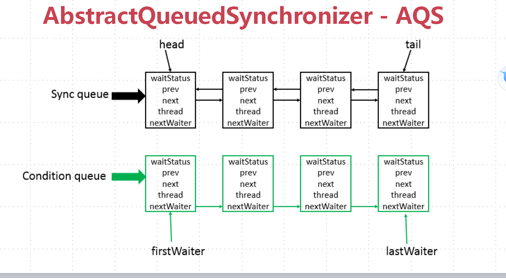
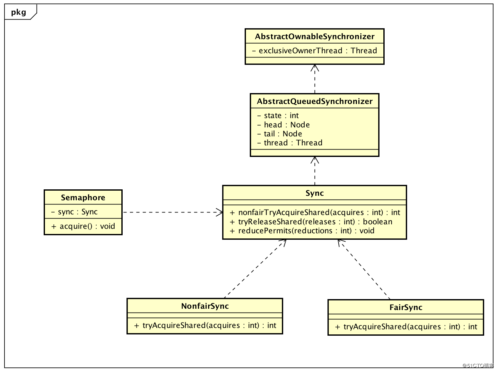
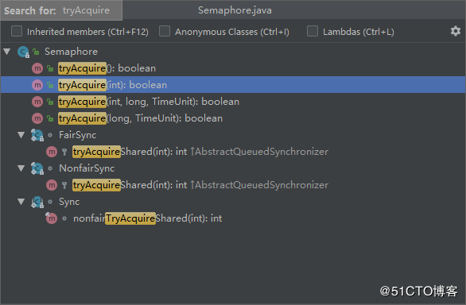
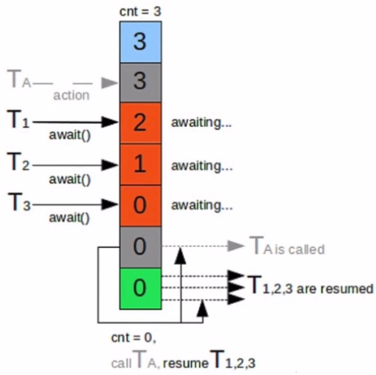

# 第06章 JUC之AQS

> Java并发包(java.util.concurrent JUC)中提供了很多并发工具，这其中，很多我们耳熟能详的并发工具，譬如ReentrangLock、Semaphore，而它们的实现都用到了一个共同的基类--AbstractQueuedSynchronizer(抽象队列同步器)，简称AQS

包路径为：`java.util.concurrent.locks.AbstractQueuedSynchronizer`

## 6.1 AQS原理和代码介绍

### 总体介绍

AbstractQueuedSynchronizer底层数据结构是一个双向链表，属于队列的一种实现,代码流程如下：



+ sync queue：同步队列，其中head节点主要负责后面的调度
+ Condition queue：单向链表，不是必须的，只有程序中使用到Condition的时候才会存在，可能会有多个Condition queue

AQS是JDK1.5开始提供的

+ 是使用基于Node实现的FIFO等待队列的阻塞锁和相关的同步器的一个同步框架，
+ 使用一个int类型的volatile变量(命名为state)来维护同步状态，通过内置的FIFO队列来完成资源获取线程的排队工作
+ 使用方法是继承
+ 子类通过继承并通过实现它的方法管理其状态{acquire和release}的方法操纵其状态
+ 可以同时实现排他锁和共享锁模式(独占exclusive、共享shared)

AbstractQueuedSynchronizer中对state的操作是原子的，且不能被继承。所有的同步机制的实现均依赖于对改变量的原子操作。为了实现不同的同步机制，我们需要创建一个非共有的(non-public internal)扩展(extends)了AQS类的内部辅助类来实现相应的同步逻辑,以java.util.concurrent.locks.ReentrantReadWriteLoc为例，其252行开始如下代码：

```java
/**
 * Synchronization implementation for ReentrantReadWriteLock.
 * Subclassed into fair and nonfair versions.
 */
abstract static class Sync extends AbstractQueuedSynchronizer {
  ......
  
```

AbstractQueuedSynchronizer并不实现任何同步接口，它提供了一些可以被具体实现类直接调用的一些原子操作方法来重写相应的同步逻辑。AQS同时提供了`独占模式(exclusive)`和`共享模式(shared)`两种不同的同步逻辑。一般情况下，子类只需要根据需求实现其中一种模式，当然也有同时实现两种模式的同步类，如ReadWriteLock

使用AQS能简单且高效地构造出应用广泛的大量的同步器，比如我们提到的ReentrantLock，Semaphore，其他的诸如`ReentrantReadWriteLock`、`SynchronousQueue`、`FutureTask`等等皆是基于AQS的。

当然，我们自己也能利用AQS非常轻松容易地构造出符合我们自己需求的同步器，由此可知`AQS是Java并发包中最为核心的一个基类`。


### 关于AQS里的state状态：

我们提到了AbstractQueuedSynchronizer维护了一个volatile int类型的变量，命名为state，用于表示当前同步状态。volatile虽然不能保证操作的原子性，但是保证了当前变量state的可见性。state的访问方式有三种:

```java
getState()
setState()
compareAndSetState()
```

这三种操作均是原子操作，其中compareAndSetState的实现依赖于Unsafe的compareAndSwapInt()方法。

### 关于自定义资源共享方式：

AQS支持两种资源共享方式：Exclusive(独占，只有一个线程能执行，如ReentrantLock)和Share(共享，多个线程可同时执行，如Semaphore/CountDownLatch)。这样方便使用者实现不同类型的同步组件，独占式如ReentrantLock，共享式如Semaphore，CountDownLatch，组合式的如ReentrantReadWriteLock。总之，AQS为使用提供了底层支撑，如何组装实现，使用者可以自由发挥。

### 关于同步器设计：

同步器的设计是基于模板方法模式的，一般的使用方式是这样：

+ 使用者继承AbstractQueuedSynchronizer并重写指定的方法。（这些重写方法很简单，无非是对于共享资源state的获取和释放）
+ 将AQS组合在自定义同步组件的实现中，并调用其模板方法，而这些模板方法会调用使用者重写的方法。这其实是模板方法模式的一个很经典的应用。

不同的自定义同步器争用共享资源的方式也不同。自定义同步器在实现时只需要实现共享资源state的获取与释放方式即可，至于具体线程等待队列的维护（如获取资源失败入队/唤醒出队等），AQS已经在底层实现好了。自定义同步器实现时主要实现以下几种方法：

```java
protected boolean isHeldExclusively()    // 该线程是否正在独占资源。只有用到condition才需要去实现它。
protected boolean tryAcquire(int)        // 独占方式。尝试获取资源，成功则返回true，失败则返回false。
protected boolean tryRelease(int)        // 独占方式。尝试释放资源，成功则返回true，失败则返回false。
protected int tryAcquireShared(int)  // 共享方式。尝试获取资源。负数表示失败；0表示成功，但没有剩余可用资源；正数表示成功，且有剩余资源。
protected boolean tryReleaseShared(int)  // 共享方式。尝试释放资源，如果释放后允许唤醒后续等待结点返回true，否则返回false。
```

### 如何使用：

首先，我们需要去继承`AbstractQueuedSynchronizer`这个类，然后我们根据我们的需求去重写相应的方法，比如
+ 要实现一个独占锁，那就去重写tryAcquire，tryRelease方法
+ 要实现共享锁，就去重写tryAcquireShared，tryReleaseShared
+ 最后，在我们的组件中调用AQS中的模板方法就可以了，而这些模板方法是会调用到我们之前重写的那些方法的。

也就是说，我们只需要很小的工作量就可以实现自己的同步组件，重写的那些方法，仅仅是一些简单的对于共享资源state的获取和释放操作，至于像是获取资源失败，线程需要阻塞之类的操作，自然是AQS帮我们完成了。

### 具体实现的思路：

+ 首先AQS内部维护了一个CLH队列，来管理锁
+ 线程尝试获取锁，如果获取失败，则将等待信息等包装成一个Node结点，加入到同步队列Sync queue里不断重新尝试获取锁（当前结点为head的直接后继才会尝试），如果获取失败，则会阻塞自己，直到被唤醒
+ 当持有锁的线程释放锁的时候，会唤醒队列中的后继线程

### 设计思想：

对于使用者来讲，我们无需关心获取资源失败，线程排队，线程阻塞/唤醒等一系列复杂的实现，这些都在AQS中为我们处理好了。我们只需要负责好自己的那个环节就好，也就是获取/释放共享资源state的姿势。很经典的模板方法设计模式的应用，AQS为我们定义好顶级逻辑的骨架，并提取出公用的线程入队列/出队列，阻塞/唤醒等一系列复杂逻辑的实现，将部分简单的可由使用者决定的操作逻辑延迟到子类中去实现即可。

### 基于AQS的同步组件：

+ CountDownLatch
+ Semaphore
+ CyclicBarrier
+ ReentrantLock
+ Condition
+ FutureTask

### AQS小结：

+ 使用Node实现FIFO队列，可以用于构建锁或者其他同步装置的基础框架
+ 利用了一个int类型表示状态，有一个state的成员变量，表示获取锁的线程数（0没有线程获取锁，1有线程获取锁，大于1表示重入锁的数量），和一个同步组件ReentrantLock。状态信息通过procted级别的getState，setState，compareAndSetState进行操作
+ 使用方法是继承，然后复写AQS中的方法，基于模板方法模式
+ 子类通过继承并通过实现它的方法管理其状态{acquire和release}的方法操作状态
+ 可以同时实现排它锁和共享锁的模式（独占、共享）

## 5.2 CountDownLatch

### 基本原理

CountDownLatch是一个同步工具类，它允许`一个或多个线程一直等待`，直到其他线程执行完后再执行。例如，应用程序的主线程希望在负责启动框架服务的线程已经启动所有框架服务之后执行。

CountDownLatch是通过一个计数器来实现的，计数器的初始化值为线程的数量。每当一个线程完成了自己的任务后，计数器的值就相应得减1。当计数器到达0时，表示所有的线程都已完成任务，然后在闭锁上等待的线程就可以恢复执行任务。


CountDownLatch的构造函数源码如下：

```java
/**
 * Constructs a {@code CountDownLatch} initialized with the given count.
 *
 * @param count the number of times {@link #countDown} must be invoked
 *        before threads can pass through {@link #await}
 * @throws IllegalArgumentException if {@code count} is negative
 */
public CountDownLatch(int count) {
    if (count < 0) throw new IllegalArgumentException("count < 0");
    this.sync = new Sync(count);
}
```

计数器count是闭锁需要等待的线程数量，只能被设置一次，且CountDownLatch没有提供任何机制去重新设置计数器count。

与CountDownLatch的第一次交互是主线程等待其他线程。主线程必须在启动其他线程后立即调用CountDownLatch.await()方法。这样主线程的操作就会在这个方法上阻塞，直到其他线程完成各自的任务。

其他N个线程必须引用CountDownLatch闭锁对象，因为它们需要通知CountDownLatch对象，它们各自完成了任务；这种通知机制是通过CountDownLatch.countDown()方法来完成的；每调用一次，count的值就减1，因此当N个线程都调用这个方法，count的值就等于0，然后主线程就可以通过await()方法，恢复执行自己的任务。

注：该计数器的操作是原子性的

### CountDownLatch使用场景：

+ 实现最大的并行性：有时我们想同时启动多个线程，实现最大程度的并行性。例如，我们想测试一个单例类。如果我们创建一个初始计数器为1的CountDownLatch，并让其他所有线程都在这个锁上等待，只需要调用一次countDown()方法就可以让其他所有等待的线程同时恢复执行。
+ 开始执行前等待N个线程完成各自任务：例如应用程序启动类要确保在处理用户请求前，所有N个外部系统都已经启动和运行了。
+ 死锁检测：一个非常方便的使用场景是你用N个线程去访问共享资源，在每个测试阶段线程数量不同，并尝试产生死锁。

### 使用示例

#### 1.基本用法：

```java
@Slf4j
public class Example1 {
    private final static int THREAD_COUNT = 200;

    public static void main(String[] args) throws InterruptedException {
        ExecutorService exec = Executors.newCachedThreadPool();
        final CountDownLatch countDownLatch = new CountDownLatch(THREAD_COUNT);

        for (int i = 0; i < THREAD_COUNT; i++) {
            final int threadNum = i;
            exec.execute(() -> {
                try {
                    test(threadNum);
                } catch (InterruptedException e) {
                    log.error("", e);
                } finally {
                    // 为防止出现异常，放在finally更保险一些
                    countDownLatch.countDown();
                }
            });
        }
        countDownLatch.await();
        log.info("finish");
        exec.shutdown();
    }

    private static void test(int threadNum) throws InterruptedException {
        TimeUnit.MILLISECONDS.sleep(100);
        log.info("{}", threadNum);
        TimeUnit.MILLISECONDS.sleep(100);
    }
}
```

#### 2.超时结束

比如有多个线程完成一个任务，但是这个任务只想给它一个指定的时间，超过这个任务就不继续等待了，完成多少算多少：

```java
// 等待指定的时间 参数1：等待时间，参数2：时间单位
countDownLatch.await(10, TimeUnit.MILLISECONDS);
```

代买见[Example2](src/main/java/com/huawei/l00379880/mythread/Chapter06AQS/Section2CountDownLatch/Example2.java)

关于CountDownLatch的其他例子可以参考另一篇文章：

[CountDownLatch类的使用](https://blog.51cto.com/zero01/2108173)

## 5.3 Semaphore

### 基本原理

Semaphore（信号量）是用来控制同时访问特定资源的线程数量，它通过协调各个线程，以保证合理的使用公共资源。

很多年以来，我都觉得从字面上很难理解Semaphore所表达的含义，只能把它比作是控制流量的红绿灯，比如XX马路要限制流量，只允许同时有一百辆车在这条路上行使，其他的都必须在路口等待，所以前一百辆车会看到绿灯，可以开进这条马路，后面的车会看到红灯，不能驶入XX马路，但是如果前一百辆中有五辆车已经离开了XX马路，那么后面就允许有5辆车驶入马路，这个例子里说的车就是线程，驶入马路就表示线程在执行，离开马路就表示线程执行完成，看见红灯就表示线程被阻塞，不能执行。


所以简单来说，**Semaphore主要作用就是可以控制同一时间并发执行的线程数。**

Semaphore有两个构造函数，参数permits表示许可数，它最后传递给了AQS的state值。线程在运行时首先获取许可，如果成功，许可数就减1，线程运行，当线程运行结束就释放许可，许可数就加1。如果许可数为0，则获取失败，线程位于AQS的等待队列中，它会被其它释放许可的线程唤醒。在创建Semaphore对象的时候还可以指定它的公平性。一般常用非公平的信号量，非公平信号量是指在获取许可时先尝试获取许可，而不必关心是否已有需要获取许可的线程位于等待队列中，如果获取失败，才会入列。而公平的信号量在获取许可时首先要查看等待队列中是否已有线程，如果有则入列。

```java
/**
 * Creates a {@code Semaphore} with the given number of
 * permits and nonfair fairness setting.
 *
 * @param permits the initial number of permits available.
 *        This value may be negative, in which case releases
 *        must occur before any acquires will be granted.
 */
public Semaphore(int permits);

 /**
 * Creates a {@code Semaphore} with the given number of
 * permits and the given fairness setting.
 *
 * @param permits the initial number of permits available.
 *        This value may be negative, in which case releases
 *        must occur before any acquires will be granted.
 * @param fair {@code true} if this semaphore will guarantee
 *        first-in first-out granting of permits under contention,
 *        else {@code false}
 */
public Semaphore(int permits, boolean fair);
```



### 使用场景

Semaphore可以用于做流量控制，特别公用资源有限的应用场景，比如数据库连接。假如有一个需求，要读取几万个文件的数据，因为都是IO密集型任务，我们可以启动几十个线程并发的读取，但是如果读到内存后，还需要存储到数据库中，而数据库的连接数只有10个，这时我们必须控制只有十个线程同时获取数据库连接保存数据，否则会报错无法获取数据库连接。这个时候，我们就可以使用Semaphore来做流控。

### 使用示例

#### 1.每次获取一个许可

```java
public class SemaphoreExample1 {
    private final static int THREAD_COUNT = 200;

    public static void main(String[] args) {
        ExecutorService exec = Executors.newCachedThreadPool();
        final Semaphore semaphore = new Semaphore(10);

        for (int i = 0; i < THREAD_COUNT; i++) {
            final int threadNum = i;
            exec.execute(() -> {
                try {
                    // 获取一个许可
                    semaphore.acquire();
                    System.out.println(threadNum);
                    // 释放一个许可
                    semaphore.release();
                } catch (InterruptedException e) {
                    e.printStackTrace();
                }
            });
        }

        exec.shutdown();
    }
}
```

示例代码见[Example1](src/main/java/com/huawei/l00379880/mythread/Chapter06AQS/Section3Semaphore/Example1.java)

在代码中，虽然有200个线程在执行，但是只允许10个并发的执行。Semaphore的构造方法Semaphore(int permits) 接收一个整型的数字，表示可用的许可证数量。所以Semaphore(10)表示允许10个线程获取许可证，也就是最大并发数是10。Semaphore的用法也很简单，首先线程使用Semaphore的acquire()获取一个许可证，使用完之后调用release()归还许可证。还可以用tryAcquire()方法尝试获取许可证。

#### 2.获取多个许可

> 如果希望每次获取多个许可的话只需要在acquire()方法的参数中进行指定即可，如下示例：

```java
// 获取多个许可
semaphore.acquire(3);
System.out.println(threadNum);
// 释放多个许可
semaphore.release(3);
```

示例代码见[Example2](src/main/java/com/huawei/l00379880/mythread/Chapter06AQS/Section3Semaphore/Example2.java)

#### 3.当并发很高，想要超过允许的并发数之后，就丢弃不处理的话

> 可以使用Semaphore里的tryAcquire()方法尝试获取许可，该方法返回boolean类型的值，我们可以通过判断这个值来抛弃超过并发数的请求。如下示例：

```java
public class SemaphoreExample3 {
    private final static int THREAD_COUNT = 200;

    public static void main(String[] args) {
        ExecutorService exec = Executors.newCachedThreadPool();
        final Semaphore semaphore = new Semaphore(10);

        for (int i = 0; i < THREAD_COUNT; i++) {
            final int threadNum = i;
            exec.execute(() -> {
                try {
                    // 尝试获取一个许可，若没有获取到许可的线程就会被抛弃，而不是阻塞
                    if (semaphore.tryAcquire()) {
                        System.out.println(threadNum);
                        // 释放一个许可
                        semaphore.release();
                    }
                } catch (Exception e) {
                    e.printStackTrace();
                }
            });
        }

        exec.shutdown();
    }
}
```

Semaphore中尝试获取许可的相关方法：



示例代码见[Example3](src/main/java/com/huawei/l00379880/mythread/Chapter06AQS/Section3Semaphore/Example3.java)

我们可以指定尝试获取许可的超时时间，例如我设置超时时间为1秒：

```java
// 尝试获取一个许可，直到超过一秒
if (semaphore.tryAcquire(1, TimeUnit.SECONDS)) {
    System.out.println(threadNum);
    // 释放一个许可
    semaphore.release();
}
```

示例代码见[Example4](src/main/java/com/huawei/l00379880/mythread/Chapter06AQS/Section3Semaphore/Example4.java)

除此之外，还可以尝试获取多个许可，并且指定超时时间：

```java
// 尝试获取多个许可，直到超过一秒
if (semaphore.tryAcquire(3, 1, TimeUnit.SECONDS)) {
    System.out.println(threadNum);
    // 释放多个许可
    semaphore.release(3);
}
```

示例代码见[Example5](src/main/java/com/huawei/l00379880/mythread/Chapter06AQS/Section3Semaphore/Example5.java)

Semaphore中其他一些常用的方法：

```java
int availablePermits()             // 返回此信号量中当前可用的许可证数。
int getQueueLength()               // 返回正在等待获取许可证的线程数。
boolean hasQueuedThreads()         // 是否有线程正在等待获取许可证。
void reducePermits(int reduction)  // 减少reduction个许可证。是个protected方法。
Collection getQueuedThreads()      // 返回所有等待获取许可证的线程集合。是个protected方法。
```

## 6.4 CyclicBarrier

### 原理

CyclicBarrier 的字面意思是可循环使用(Cyclic)的屏障(Barrier)。

它要做的事情是，
+ 让一组线程到达一个屏障(也可以叫同步点)时被阻塞，直到最后一个线程到达屏障时，屏障才会开门，所有被屏障拦截的线程才会继续干活。
+ 当某个线程调用了await方法之后，就会进入等待状态，并将计数器-1，直到所有线程调用await方法使计数器为0，才可以继续执行.

由于计数器可以重复使用，所以我们又叫他循环屏障。

CyclicBarrier默认的构造方法是`CyclicBarrier(int parties)`，其参数表示屏障拦截的线程数量，每个线程调用await方法告诉CyclicBarrier我已经到达了屏障，然后当前线程被阻塞。



### 应用场景

CyclicBarrier可以用于多线程计算数据，最后合并计算结果的应用场景。比如我们用一个Excel保存了用户所有银行流水，每个Sheet保存一个帐户近一年的每笔银行流水，现在需要统计用户的日均银行流水，先用多线程处理每个sheet里的银行流水，都执行完之后，得到每个sheet的日均银行流水，最后，再用barrierAction用这些线程的计算结果，计算出整个Excel的日均银行流水。

### CyclicBarrier和CountDownLatch区别

+ 可重入性
  + CountDownLatch的计数器只能使用一次。
  + 而CyclicBarrier的计数器可以使用reset() 方法重置。所以CyclicBarrier能处理更为复杂的业务场景，比如如果计算发生错误，可以重置计数器，并让线程们重新执行一次。
+ 线程关系
  + CountDownLatch主要用于实现一个或n个线程需要等待其他线程完成某项操作之后，才能继续往下执行，描述的是一个或n个线程等待其他线程的关系
  + CyclicBarrier是多个线程相互等待，直到满足条件以后再一起往下执行。描述的是多个线程相互等待的场景

### 方法列表

CyclicBarrier还提供其他有用的方法，比如getNumberWaiting方法可以获得CyclicBarrier阻塞的线程数量。isBroken方法用来知道阻塞的线程是否被中断。


### 使用示例

#### 1.基本使用

```java
@Slf4j
public class CyclicBarrierExample1 {
    // 给定一个值，说明有多少个线程同步等待
    private static CyclicBarrier barrier = new CyclicBarrier(5);

    public static void main(String[] args) throws InterruptedException {
        ExecutorService exec = Executors.newCachedThreadPool();

        for (int i = 0; i < 10; i++) {
            final int num = i;
            // 延迟1秒，方便观察
            Thread.sleep(1000);
            exec.execute(() -> {
                try {
                    CyclicBarrierExample1.race(num);
                } catch (Exception e) {
                    log.error("", e);
                }
            });
        }
        exec.shutdown();
    }

    private static void race(int num) throws Exception {
        Thread.sleep(1000);
        log.info("{} is ready", num);
        // 阻塞线程
        barrier.await();
        log.info("{} continue", num);
    }
}
```

#### 2.以防await无限阻塞进程，我们可以设置await的超时时间

> 修改race方法代码如下

```java
private static void race(int num) throws Exception {
    Thread.sleep(1000);
    log.info("{} is ready", num);
    try {
        // 由于设置了超时时间后阻塞的线程可能会被中断，抛出BarrierException异常，如果想继续往下执行，需要加上try-catch
        barrier.await(2000, TimeUnit.MILLISECONDS);
    } catch (InterruptedException | TimeoutException | BrokenBarrierException e) {
        // isBroken方法用来知道阻塞的线程是否被中断
        log.warn("exception occurred {} {}. isBroken : {}", e.getClass().getName(), e.getMessage(), barrier.isBroken());
    }
    log.info("{} continue", num);
}
```

#### 3.希望当所有线程到达屏障后就执行一个runnable的话

> 可以使用`CyclicBarrier(int parties, Runnable barrierAction)`构造函数传递一个runnable实例。如下示例：

```java
/**
 * 当线程全部到达屏障时，优先执行这里传入的runnable
 */
private static CyclicBarrier barrier = new CyclicBarrier(5, () -> log.info("callback is running"));
```

## 6.5~6.6 ReentrantLock与锁

在Java里一共有两类锁，一类是synchornized同步锁，还有一种是JUC里提供的锁Lock，Lock是个接口，其核心实现类就是ReentrantLock。

synchornized与ReentrantLock的区别对比如下表：

| 对比维度                                                     | synchornized                                                 | ReentrantLock                  |
| :----------------------------------------------------------- | :----------------------------------------------------------- | :----------------------------- |
| 可重入性（线程进入锁的时候计数器就自增1，计数器下降为0则会释放锁） | 可重入                                                       | 可重入                         |
| 锁的实现                                                     | JVM实现，很难操作源码                                        | JDK实现，可以观察其源码        |
| 性能                                                         | 在引入偏向锁、轻量级锁/自旋锁后性能大大提升，官方建议无特殊要求时尽量使用synchornized，并且新版本的一些jdk源码都由之前的ReentrantLock改成了synchornized | 与优化后的synchornized相差不大 |
| 功能区别                                                     | 方便简洁，由编译器负责加锁和释放锁                           | 需手工操作锁的加锁和释放       |
| 锁粒度                                                       | 粗粒度，不灵活                                               | 细粒度，可灵活控制             |
| 可否指定公平锁                                               | 不可以                                                       | 可以                           |
| 可否放弃锁                                                   | 不可以                                                       | 可以                           |