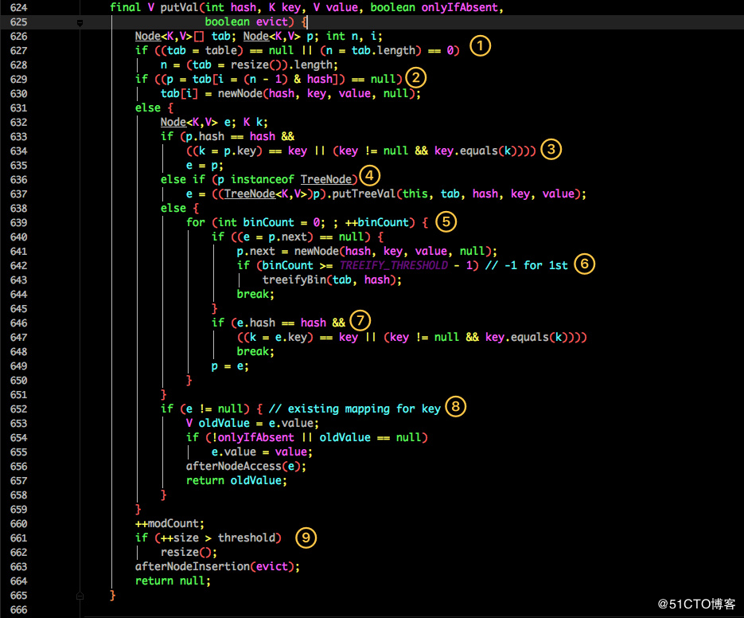
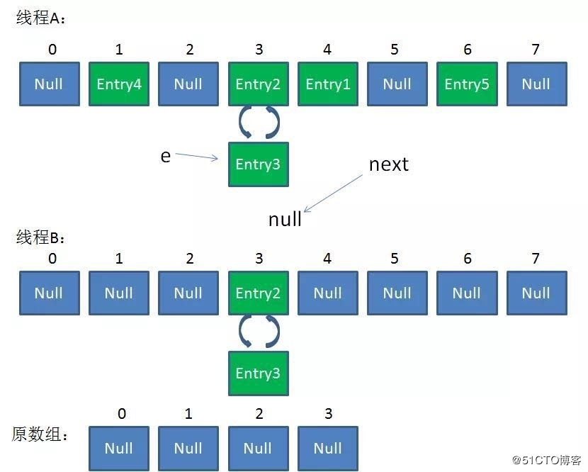

# 9.4 HaspMap与ConcurrentHashMap

参考文章[HashMap? ConcurrentHashMap? 相信看完这篇没人能难住你！](https://blog.51cto.com/zero01/2307070)

Map 这样的 Key Value 在软件开发中是非常经典的结构，常用于在内存中存放数据。

本篇主要想讨论 ConcurrentHashMap 这样一个并发容器，在正式开始之前我觉得有必要谈谈 HashMap，没有它就不会有后面的 ConcurrentHashMap。

## JDK1.7中的HashMap

众所周知 HashMap 底层是基于 数组 + 链表 组成的，不过在 jdk1.7 和 1.8 中具体实现稍有不同。在 1.7 中HashMap的数据结构图如下：


我们先来看看1.7中HashMap的实现，源码如下：


这是 HashMap 中比较核心的几个成员变量；看看分别是什么意思？

初始化桶大小，因为底层是数组，所以这是数组默认的大小。

+ 1.桶最大值。
+ 2.默认的负载因子（0.75）
+ 3.table 真正存放数据的数组。
+ 4.Map 存放数量的大小。
+ 5.桶大小，可在初始化时显式指定。
+ 6.负载因子，可在初始化时显式指定。

这里重点解释一下负载因子，HashMap中共有四个构造函数，我们来看一下HashMap中较为重要的两个构造函数，源码如下：

```java
public HashMap() {
    this(DEFAULT_INITIAL_CAPACITY, DEFAULT_LOAD_FACTOR);
}

public HashMap(int initialCapacity, float loadFactor) {
    if (initialCapacity < 0)
        throw new IllegalArgumentException("Illegal initial capacity: " + initialCapacity);
    if (initialCapacity > MAXIMUM_CAPACITY)
        initialCapacity = MAXIMUM_CAPACITY;
    if (loadFactor <= 0 || Float.isNaN(loadFactor))
        throw new IllegalArgumentException("Illegal load factor: " + loadFactor);

    this.loadFactor = loadFactor;
    threshold = initialCapacity;
    init();
}
```

由于给定的 HashMap 的容量大小是固定的，而从源码中可以看到默认初始化时给定的默认容量为 16，负载因子为 0.75。Map 在使用过程中不断的往里面存放数据，当数量达到了 16 * 0.75 = 12 就需要将当前 16 的容量进行扩容，而扩容这个过程涉及到 rehash、复制数据等操作，所以非常消耗性能。

因此通常建议能`提前预估HashMap的大小最好`，尽量的减少扩容带来的性能损耗。根据代码可以看到其实真正存放数据的数组是：

```java
transient Entry<K,V>[] table = (Entry<K,V>[]) EMPTY_TABLE;
```

那么这个数组，它又是如何定义的呢？如下：


Entry 是 HashMap 中的一个内部类，从他的成员变量很容易看出：

+ key就是写入时的键。
+ value自然就是值。
+ 开始的时候就提到 HashMap 是由数组和链表组成，所以这个 next 就是用于实现链表结构。
+ hash存放的是当前 key 的 hashcode

知晓了基本结构后，那我们来看看其中最为重要的写入以及获取函数。

### 1.put方法

```java
public V put(K key, V value) {
    if (table == EMPTY_TABLE) {
        inflateTable(threshold);
    }
    if (key == null)
        return putForNullKey(value);
    int hash = hash(key);
    int i = indexFor(hash, table.length);
    for (Entry<K,V> e = table[i]; e != null; e = e.next) {
        Object k;
        if (e.hash == hash && ((k = e.key) == key || key.equals(k))) {
            V oldValue = e.value;
            e.value = value;
            e.recordAccess(this);
            return oldValue;
        }
    }
    modCount++;
    addEntry(hash, key, value, i);
    return null;
}    
```

源码说明：

+ 判断当前数组是否需要初始化。
+ 如果 key 为空，则 put 一个空值进去。
+ 根据 key 计算出 hashcode。
+ 根据计算出的 hashcode 定位出所在桶。
+ 如果桶是一个链表则需要遍历判断里面的 hashcode、key 是否和传入 key 相等，如果相等则进行覆盖，并返回原来的值。
+ 如果桶是空的，说明当前位置没有数据存入；新增一个 Entry 对象写入当前位置。

### 2、addEntry与createEntry方法

```java
void addEntry(int hash, K key, V value, int bucketIndex) {
    if ((size >= threshold) && (null != table[bucketIndex])) {
        resize(2 * table.length);
        hash = (null != key) ? hash(key) : 0;
        bucketIndex = indexFor(hash, table.length);
    }
    createEntry(hash, key, value, bucketIndex);
}

void createEntry(int hash, K key, V value, int bucketIndex) {
    Entry<K,V> e = table[bucketIndex];
    table[bucketIndex] = new Entry<>(hash, key, value, e);
    size++;
}    
```

源码说明：

+ 当调用 addEntry 写入 Entry 时需要判断是否需要扩容。
+ 如果需要就进行两倍扩充，并将当前的 key 重新 hash 并定位。
+ 而在 createEntry 中会将当前位置的桶传入到新建的桶中，如果当前桶有值就会在位置形成链表。

### 3、get方法

再来看看 get 方法，以及该方法内调用的 getEntry 方法：

```java
public V get(Object key) {
    if (key == null)
        return getForNullKey();
    Entry<K,V> entry = getEntry(key);
    return null == entry ? null : entry.getValue();
}

final Entry<K,V> getEntry(Object key) {
    if (size == 0) {
        return null;
    }

    int hash = (key == null) ? 0 : hash(key);
    for (Entry<K,V> e = table[indexFor(hash, table.length)]; e != null; e = e.next) {
        Object k;
        if (e.hash == hash && ((k = e.key) == key || (key != null && key.equals(k))))
            return e;
    }   
    return null;
}    
```

源码说明：

+ 首先也是根据key计算出hashcode，然后定位到具体的桶中
+ 判断该位置是否为链表
+ 不是链表就根据key、key的hashcode是否相等来返回值
+ 为链表则需要遍历直到key及hashcode 相等时候就返回值
+ 啥都没取到就直接返回null

## JDK1.8中的HashMap

不知道从 1.7 的实现大家看出需要优化的点没有？其实一个很明显需要优化的地方就是：

> 当 Hash 冲突严重时，在桶上形成的链表会变的越来越长，这样在查询时的效率就会越来越低；时间复杂度为 O(N)


我们先来看看在1.8中HashMap几个核心的成员变量：

```java
/**
 * The default initial capacity - MUST be a power of two.
 */
static final int DEFAULT_INITIAL_CAPACITY = 1 << 4; // aka 16

/**
 * The maximum capacity, used if a higher value is implicitly specified
 * by either of the constructors with arguments.
 * MUST be a power of two <= 1<<30.
 */
static final int MAXIMUM_CAPACITY = 1 << 30;

/**
 * The load factor used when none specified in constructor.
 */
static final float DEFAULT_LOAD_FACTOR = 0.75f;

/**
 * The bin count threshold for using a tree rather than list for a
 * bin.  Bins are converted to trees when adding an element to a
 * bin with at least this many nodes. The value must be greater
 * than 2 and should be at least 8 to mesh with assumptions in
 * tree removal about conversion back to plain bins upon
 * shrinkage.
 */
static final int TREEIFY_THRESHOLD = 8;

/**
 * The table, initialized on first use, and resized as
 * necessary. When allocated, length is always a power of two.
 * (We also tolerate length zero in some operations to allow
 * bootstrapping mechanics that are currently not needed.)
 */
transient Node<K,V>[] table;

/**
 * Holds cached entrySet(). Note that AbstractMap fields are used
 * for keySet() and values().
 */
transient Set<Map.Entry<K,V>> entrySet;

/**
 * The number of key-value mappings contained in this map.
 */
transient int size;
```

可以看到，和 1.7 大体上都差不多，还是有几个重要的区别：

+ TREEIFY_THRESHOLD用于判断是否需要将链表转换为红黑树的阈值
+ HashEntry修改为Node

Node 的核心组成其实也是和 1.7 中的 HashEntry 一样，存放的都是 key value hashcode next 等数据

`然后我们再来看看核心方法。`

### 1.put方法(put里调用的是putVal)



看似要比 1.7 的复杂，我们一步步进行拆解：

+ 判断当前桶是否为空，空的就需要初始化（resize 中会判断是否进行初始化）。
+ 根据当前 key 的 hashcode 定位到具体的桶中并判断是否为空，为空表明没有 Hash 冲突就直接在当前位置创建一个新桶即可。
+ 如果当前桶有值（ Hash 冲突），那么就要比较当前桶中的 key、key 的 hashcode 与写入的 key 是否相等，相等就赋值给 e,在第 8 步的时候会统一进行赋值及返回。
+ 如果当前桶为红黑树，那就要按照红黑树的方式写入数据。
+ 如果是个链表，就需要将当前的 key、value 封装成一个新节点写入到当前桶的后面（形成链表）。
+ 接着判断当前链表的大小是否大于预设的阈值，大于时就要转换为红黑树。
+ 如果在遍历过程中找到 key 相同时直接退出遍历。
+ 如果 e != null 就相当于存在相同的 key,那就需要将值覆盖。
+ 最后判断是否需要进行扩容

### 2、get 方法(get里调用的是getNode)

```java
public V get(Object key) {
    Node<K,V> e;
    return (e = getNode(hash(key), key)) == null ? null : e.value;
}

final Node<K,V> getNode(int hash, Object key) {
    Node<K,V>[] tab; Node<K,V> first, e; int n; K k;
    if ((tab = table) != null && (n = tab.length) > 0 &&
        (first = tab[(n - 1) & hash]) != null) {
        if (first.hash == hash && // always check first node
            ((k = first.key) == key || (key != null && key.equals(k))))
            return first;
        if ((e = first.next) != null) {
            if (first instanceof TreeNode)
                return ((TreeNode<K,V>)first).getTreeNode(hash, key);
            do {
                if (e.hash == hash &&
                    ((k = e.key) == key || (key != null && key.equals(k))))
                    return e;
            } while ((e = e.next) != null);
        }
    }
    return null;
}
```
get 方法看起来就要简单许多了：

+ 首先将 key hash 之后取得所定位的桶
+ 如果桶为空则直接返回 null 。
+ 否则判断桶的第一个位置(有可能是链表、红黑树)的 key 是否为查询的 key，是就直接返回 value。
+ 如果第一个不匹配，则判断它的下一个是红黑树还是链表。
+ 红黑树就按照树的查找方式返回值。
+ 不然就按照链表的方式遍历匹配返回值

从这两个核心方法(get/put)可以看出 1.8 中对大链表做了优化，`修改为红黑树之后查询效率直接提高到了O(logn)`

## HashMap存在的问题

但是 HashMap 原有的问题也都存在，比如在并发场景下使用时容易出现死循环，如下示例：

```java
final HashMap<String, String> map = new HashMap<String, String>();
for (int i = 0; i < 1000; i++) {
    new Thread(new Runnable() {
        @Override
        public void run() {
            map.put(UUID.randomUUID().toString(), "");
        }
    }).start();
}
```

但是为什么呢？我们来简单分析一下。上文中提到`在HashMap扩容的时候会调用resize()方法，就是这里的并发操作容易在一个桶上形成环形链表`；这样当获取一个不存在的 key 时，计算出的 index 正好是环形链表的下标就会出现死循环。

我们先来看单线程下的rehash过程，如下图：


多线程并发下的rehash过程，如下图：


