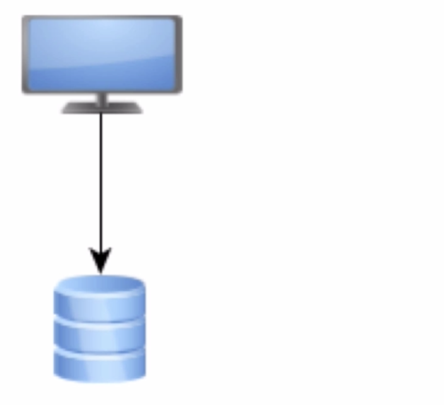
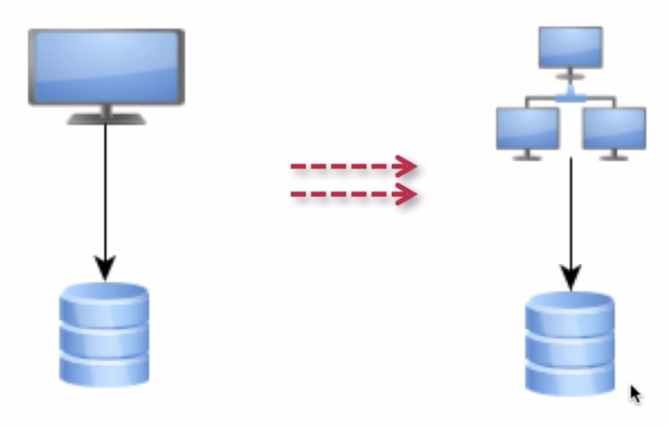
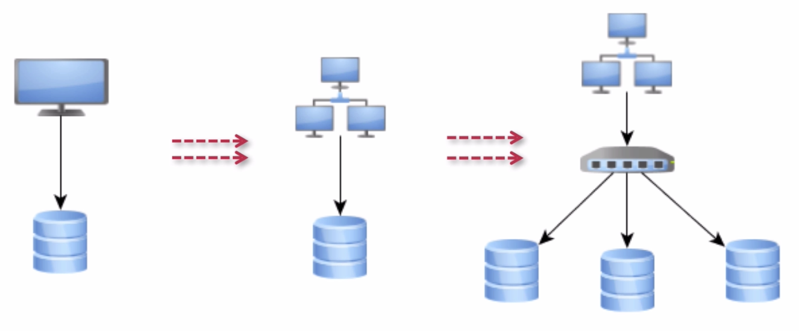
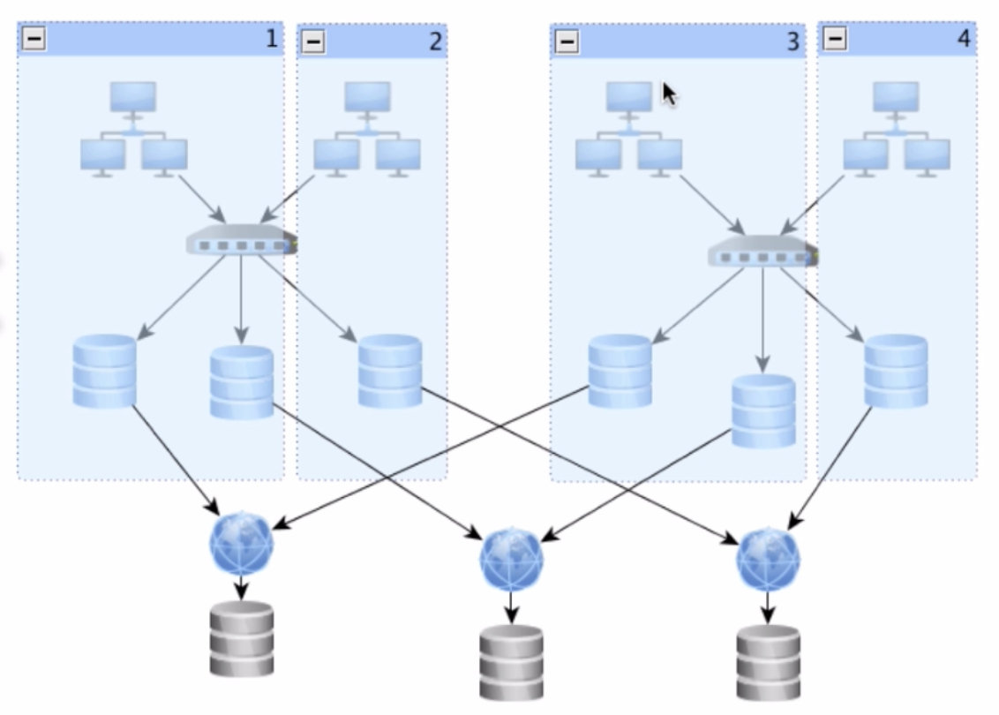

# 第10章 扩容思路讲解

## 为什么需要扩容？

了解Java 内存结构的伙伴应该都知道 , 每个线程都有自己的工作内存, 占用内存大小取决于工作内存里变量的多少与大小 , 单个线程占用内存通常不会很大, 但是随着并发的线程不断的增加 , 从成百上千, 甚至几十万 , 占用的内存就会越来越多.这时候可能就要考虑给系统扩容了 , 简单点的 升级内存, 复杂点的 , 增加服务器 , 分担压力.

## 扩容分类

+ 垂直扩容(纵向扩展)
  > 比如上面提到的 增加内存，垂直扩容的主要是提高系统部件的能力,但会增大单个服务中其他软件设施的依赖与管理、服务内部复杂度
+ 水平扩容(横向扩展) 
  > 比如上面提到的 增加服务器，水平扩容主要是增加更多的成员来分担压力，但会增加网络、数据库IO开销、管理多个服务器的难度

## 扩容详解

### 单机房单节点部署

刚开始所有的项目可能都是这样的,一台服务器支撑起所有的服务且数据库 文件存储都在一台机器上

### 单机房多节点部署

直接带来的是服务器的压力越来越大其中最直观的表现就是服务器可以使用的内存越来越少,每个人的每个请求服务器都需要申请额外的空间来申请,同时使用的人数越多同一时刻发出的请求就越多;服务要使用的内存就会越多带来的就是服务器的压力越来越大,同时每个服务器都是升级的需要为了更好的用户体验,我们都不希望升级的时候导致服务全部不能使用,但是升级就必须要重启这个时候我们就需要通过集群来实现了;

### 单机房多节点多数据库

演进到这一步我们可以直接的看出当前的服务器已经不是单点,我们可以根据需要增加服务器的数量来提高处理能力,同时一台服务器的重启不会应用整体的服务对于用户来说也是无感知的,因此这样的集群方式也非常受欢迎;然而集群带来便利的同时也带来的新的问题,比如此时的数据库将会成为我们的瓶颈,这个时候我们就需要一个数据库主从的架构来支撑我们的服务;

### 多机房多节点多数据库部署

如上图所示这个时候我们可以使用多个数据库,将其中的一个作为主库其他的作为从库来使用,主库主要负责写操作以及必要的读操作,从库负责读操作;这样的话数据的压力就会小很多性能就会提升;需要注意的是我们不能把所有的读操作都放到从库上边,因为有很多业务会对状态类的字段特别敏感,尤其是涉及到钱的地方,此时的一个状态会对整个链路产生非常大的影响,如果此时主从库之间的同步存在延时的话就会出现问题;当演进到这一步的时候还是会有一定的潜在问题存在的,比如所有的服务器都部署在一个机房中如果突然断电将是灾难性的,这个时候就需要我们把服务器部署到多个机房内

### 最终的架构：异地多活、域名绑定数据库

此时采用多机房部署的话就会对断电的情况有非常大的改善,但是这个时候如果我们将主库放到某一个机房内,如果出现网络波动以及断电的情况也是非常危险的,所以我们要解决这个问题,我们不能采用ip + 端口直连数据库的方式而是通过域名进行连接这样就能有效的转移主库降低风险;到了这一步可以说这个扩容已经非常成功了,但是还有更加高大上的架构比如异地多活 单元化等(如下所示);

我们根据这个简略图来简单说明一下这个架构,图中左侧我们可以看成是一个地区中心比如北京,右侧为上海中心,这样就是两个城市分别单独部署了一套集群;正常情况下他们都是相对独立的但是他们提供了相同的服务在通过一些机制完成数据的同步(不代表同步全部数据也可只同步必要的数据),如果此时某一个单元出问题了我们可以快速的将流向一个单元的流量切换到另一个单元上去,这样的方式可以充分的解决容灾的问题也提升了单机房容量的瓶颈;演进到这里可以说是已经达到了一定的高度;

## 对数据库的扩容

### 读操作扩容：

假如网站是读操作比较多，比如博客这类。通过通过mysql进行垂直扩展是个不错的选择，并且结合memcathe、redis、CDN等构建一个健壮的缓存系统。如果系统超负荷运行，将更多的数据放在缓存中来缓解系统的读压力。采用水平扩容没有太大的意义，因为性能的瓶颈不在写操作，所以不需要实时去完成，用更多的服务器来分担压力性价比太低。所以针对单个系统去强化它的读性能就可以了

### 写操作扩容

假如写操作比较多，比如大型网站的交易系统，可考虑可水平扩展的数据存储方式，比如Cassandra、Hbase等。和大多数的关系型数据库不同，这种数据存储会随着增长增加更多的节点。也可以考虑垂直扩容提升单个数据库的性能，但会发现资金与硬盘的IO能力是有限的，所以需要增加更多数据库来分担写的压力。

## 扩容与高并发的关系

高并发并不是意味着我们需要将代码写的多么的高大上,而是基于大前提下尽可能的保证服务的可用性,这与表示我们所谓的高并发不是一套固定的体系,而是需要根据已有的业务场景以及当前的情况尽可能的保证服务的可用性,不同的业务场景应对高并发的手段差别非常大,而每一种手段解决的问题点都不一样;
