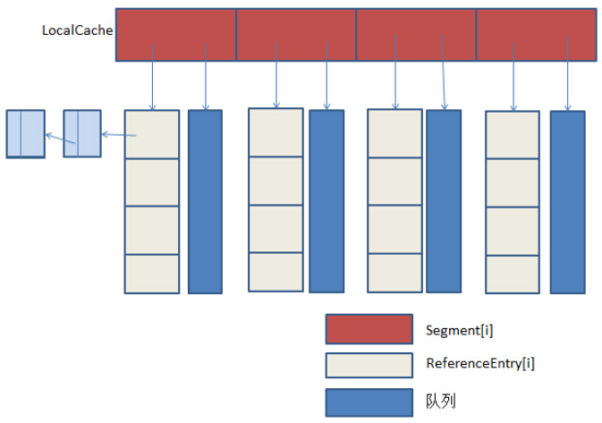
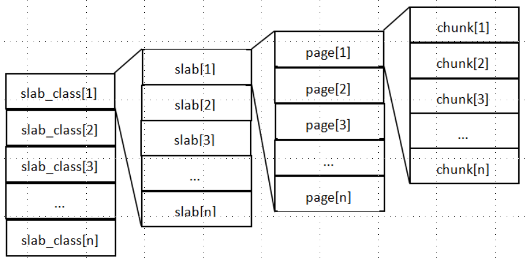
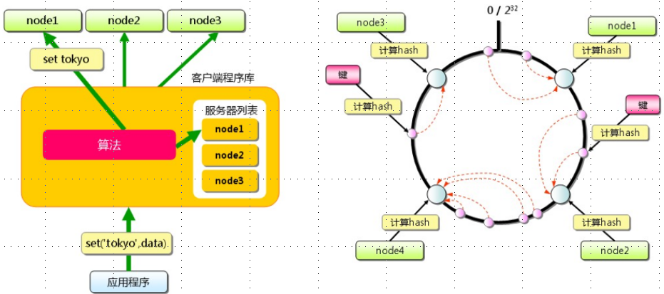
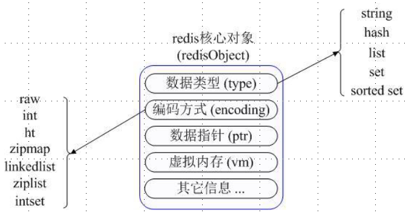
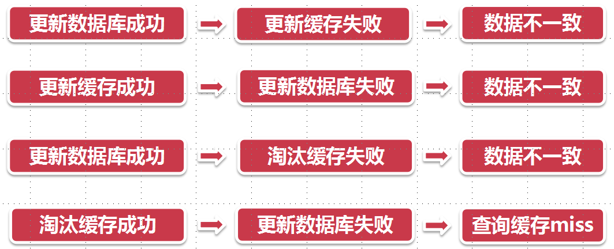
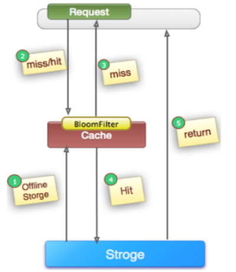

# 第11章 高并发之缓存

参考文章

+ [SupriseMF的博客](https://github.com/SupriseMF/SupriseMF.github.io/tree/master/2018/08/03) 
+ [JAVA并发编程与高并发解决方案 - 视频第12章（高并发之缓存思路）](https://blog.csdn.net/csdnlijingran/article/details/83216601)

## 1、缓存之特征、场景和组件介绍

### 1.1 概述

此处的缓存非彼之计算机缓存。该缓存主要是`降低高并发对数据库冲击`，提高数据访问速度、查询命中的数据库缓存。当然也有静态缓存、动态缓存。(这些我只知其名)


### 1.2 缓存的特征

+ **命中率**(高并发中的重要指标)：简单表示为：命中数/(命中数+未命中数)；未命中即未通过缓存获取到想要的数据，可能数据不存在或缓存已过期。
+ **最大元素**(或最大空间)：缓存中可以存放的元素数量。一旦缓存中的数据数量超过该值，会触发缓存的清除策略
+ **清空策略**：FIFO、LFU（使用频率最小策略）、LRU（最近最少被使用策略）、过期时间、随机清除等。
  + FIFO是first in first out，在缓存中最先被创建的数据再被清除时会被优先考虑清除。适用于`对数据的实时性要求较高的场景`，保证最新的数据可用。
  + LFU是无论数据是否过期，通过比较各数据的命中率，`优先清除命中率最低的数据`。
  + LRU是无论数据是否过期，通过比较数据最近一次被使用（即调用get()）的时间戳，优先清除距今最久的数据，以`保证热点数据的可用性`。(**多数缓存框架都采用LRU策略**）
  + 过期时间策略是，通过比较过期时间`清除过期时间最长的数据`，或通过过期时间，`清除最近要过期的数据`。
  
### 1.3 缓存命中率的影响因素

+ 1、业务场景和业务需求：显然，缓存是为了减轻读数据操作的缓冲方式。
  + 适用于`读多写少`的场景。
  + `对数据的实时性要求不高`。因为数据缓存的时间越长，数据的命中率越高。
+ 2、缓存的设计：粒度和策略
  + 缓存的`粒度越小`，灵活度高，命中率越高；粒度越小，越不易被其他操作（修改）涉及到，保存在缓存中的时间越久，越易被命中。
  + 当缓存中的数据变化时，直接更新缓存中的相应数据（虽然一定程度上会提高系统复杂度），而不是移除或设置数据过期，会提高缓存的命中率。
+ 3、缓存容量和基础设施。
  + 当然，`缓存容量越大`，缓存命中率越高。
  + 缓存的技术选型：采用应用内置的`内地缓存容易造成单机瓶颈`，而采用`分布式缓存则具有更好的拓展性、伸缩性`。
+ 4、不同的缓存框架中的缓存命中率也不尽相同。
+ 5、当`缓存结点发生故障`，需要避免缓存失效并最大程度地减少影响。可通过`一致性hash算法`或结点冗余方式避免结点故障。
+ 6、多线程并发越高，缓存的效益越高，即收益越高，即使缓存时间很短。

### 1.4 提高缓存命中率的方法

+ 要求应用尽可能地通过缓存访问数据，避免缓存失效
+ 结合上面介绍的命中率影响因素：缓存粒度、策略、容量、技术选型等结合考虑

### 1.5 缓存的分类

根据缓存和应用的耦合度进行分类：

#### 1、本地缓存：

> 指应用中的缓存组件，主要通过编程实现（使用成员变量、局部变量、静态变量）或使用现成的Guava Cache框架。

+ 优点：应用和cache都在同一个进程内部。请求缓存速度快，无网络开销。单机应用中，不需要集群支持时；或集群情况下，各结点不需要互相通知时，适合使用本地缓存。
+ 缺点：应用和cache的耦合度高，各应用间无法共享缓存，导致各结点或单机应用需要维护自己的缓存，可能会造成内存浪费。

#### 2、分布式缓存：

> 指的是应用分离的缓存组件或服务，主要现在流行的有：Memcache、Redis。
优点：自己本身就是一个独立的服务，与本地应用是隔离的，多个应用可以共享缓存；

## 2 Guava Cache介绍

> 它是`本地缓存`的实现框架



可以看出来，它的实现原理`类似ConcurrentHashMap`，使用`多个segment细粒度锁`，既保证了线程安全，又支持高并发场景需求。该类Cache类似于一个Map，也是存储键值对的集合，但它还需要处理缓存过期、动态加载等算法逻辑；根据面向对象的思想，它还需要做方法与数据关联性的封装。

Guava Cache实现的主要功能有：
+ 自动将结点加入到缓存结构中
+ 当缓存中结点超过设置的最大元素值时，使用LRU算法实现缓存清除
+ 它缓存的key封装在weakReference（弱引用）中，它缓存的value缓存在weakReference（弱引用）或softReference（软引用）中
+ 它可以统计缓存中各数据的命中率、异常率、未命中率等数据

## 3 Memcache

### Memcache组成

它是一个高效的分布式内存cache，是众多广泛应用的开源分布式缓存的框架之一

内存结构图如下：



其中涉及到四个部分：按部分作用区域由大到小分别为

+ 1、slab_class：板层类
+ 2、slab：板层。
+ 3、page：页。
+ 4、chunk：块。是真正存放数据的地方。

注意：

+ 同一个slab内的chunk的大小是固定的。而具有相同chunk的slab被分组为chunk_slab。
+ Memcache的内存的分配器成为allocator。其中slab的数量有限，与启动参数的配置有关。
+ 其中的value总是会被存放到与value占用空间大小最接近的chunk的slab中，以在不降低系统性能情况下节约内存空间。
+ 在创建slab时，首先申请内存；其中是以page为单位分配给slab空间，其中，一般page为1M大小；page按照该slab的chunk大小进行切分并形成数组。

### Memcache原理



它本身不提供分布式的解决方案。在服务端，Memcache的集群环境实际上就是一个个Memcache服务器的堆积。它cache的分布式机制是在客户端实现。通过客户端的路由来处理，以达到分布式解决方案的目的。

### 客户端做路由的原理：

+ 客户端采用`hash一致性算法`，上图中右侧即是其路由的计算方法
+ 相对于一般的hash算法，如取模方式，它除了`计算key的hash`外，还计算`每一个server的hash值`，最后`将这些hash值映射到一个指定域上`，如图中的 0-2^32。
+ 顺时针找到的第一个node节点，即为key存放的位置：通过`寻找大于key的hash值的最小server`作为存储该key的目标server；如果`未找到`，则直接将`具有最小hash值`的server作为目标server。
+ 该机制一定程度上解决了扩容问题。增加或删除某个结点对于该集群来说不会有大影响。
+ 最近版本中，Memcache又增加了`虚拟结点`的设计，进一步提高系统可用性

### Memcache的内存分配和回收算法

+ 在Memcache的内存分配中，chunk空间并不会被value完全占用，总会有内存浪费
+ Memcache的LRU回收算法不是针对全局的，而是slab的
+ Memcache中对允许存放的value占用空间大小有限制。因为内存空间分配是slab以page为单位被分配空间，而`page大小规定最大为1M`。

### Memcache的限制和特性

+ 1、Memcache对存储的item数量没有限制
+ 2、Memcache单进程在32位机器上限制的内存大小为2G，即2的32次方的bit。而64位机器则没有内存大小限制。
+ 3、Memcache的key最大为250个字节；若超过则无法存储。其可存储的value最大为1M，即page最大可分配的大小，此时page中只分配了（形成）一个chunk。
+ 4、Memcache的服务器端是非安全的。当已知一个Memcache结点，外部进入后可通过flushAll命令，使已经存在的键值对立即失效。
+ 5、Memcache不能遍历其中存储的所有item。因为该操作会使其他的访问、创建等操作阻塞，且该进程十分缓慢。
+ 6、Memcache的高性能来源于两个阶段的hash结构：第一个是客户端（该hash算法根据key值算出一个结点）；第二个是服务端（通过一个内部的hash算法，查找真正的item并返回给客户端）。
+ 7、Memcache是一个非阻塞的基于事件的服务程序。

## 4 缓存之初识Redis

### 4.1 概述

> Redis即Remote Dictionary Service的简称，即远程字典服务

它是一个`远程的非关系型内存数据库`。性能强劲。具有复制特性，以及为解决数据而生的独一无二的数据模型：可以存储键值对、以及五种不同类型的值之间的映射。并提供将内存中数据持久化到硬盘功能。可以使用复制特性扩展读性能；可以使用客户端分片扩展写性能。



### 4.2 Redis特点

+ 1、支持数据的持久化，将内存中数据持久化到硬盘，重启后可以再次加载至内存。
+ 2、支持上图中string、hash、list、set、sorted set等数据类型。
+ 3、支持数据的备份，即master-slave主从数据备份。
+ 4、功能强大：

此外还有

+ 性能极高：读取速度高达11W/s，写速度高达8.1W/s（官方数据）。
+ 支持丰富的数据类型。
+ 其操作均具有原子性，包括多个操作后另外操作的原子性。
+ 支持publish、subscribe、通知、key过期等等功能。

### 4.3 Redis适用场景

+ 1、当需要取出n个最新数据的操作时。
+ 2、当需要实现排行榜类似的应用时。
+ 3、当需要精准设定过期时间的应用时。
+ 4、当需要使用计数器的应用时。
+ 5、当需要做唯一性检查时。
+ 6、当需要获取某一时间段内所有数据排头的数据时。
+ 7、实时系统。
+ 8、垃圾系统。
+ 9、使用pub、sub构建消息系统。
+ 10、构建队列系统。
+ 11、实现最基础的缓存功能时。

### 4.2 redis的小例子

RedisConfig

```java
package com.mmall.concurrency.example.cache;

import org.springframework.beans.factory.annotation.Value;
import org.springframework.context.annotation.Bean;
import org.springframework.context.annotation.Configuration;
import redis.clients.jedis.JedisPool;

@Configuration
public class RedisConfig {

    @Bean(name = "redisPool")
    public JedisPool jedisPool(@Value("${jedis.host}") String host,
                               @Value("${jedis.port}") int port) {
        return new JedisPool(host, port);
    }
}
```

RedisClient

```java
package com.mmall.concurrency.example.cache;

import org.springframework.stereotype.Component;
import redis.clients.jedis.Jedis;
import redis.clients.jedis.JedisPool;

import javax.annotation.Resource;

// http://redis.cn/
@Component
public class RedisClient {

    @Resource(name = "redisPool")
    private JedisPool jedisPool;

    public void set(String key, String value) throws Exception {
        Jedis jedis = null;
        try {
            jedis = jedisPool.getResource();
            jedis.set(key, value);
        } finally {
            if (jedis != null) {
                jedis.close();
            }
        }
    }


    public String get(String key) throws Exception {
        Jedis jedis = null;
        try {
            jedis = jedisPool.getResource();
            return jedis.get(key);
        } finally {
            if (jedis != null) {
                jedis.close();
            }
        }
    }
}
```

CacheController

```java
package com.mmall.concurrency.example.cache;

import org.springframework.beans.factory.annotation.Autowired;
import org.springframework.stereotype.Controller;
import org.springframework.web.bind.annotation.RequestMapping;
import org.springframework.web.bind.annotation.RequestParam;
import org.springframework.web.bind.annotation.ResponseBody;

@Controller
@RequestMapping("/cache")
public class CacheController {

    @Autowired
    private RedisClient redisClient;

    @RequestMapping("/set")
    @ResponseBody
    public String set(@RequestParam("k") String k, @RequestParam("v") String v)
            throws Exception {
        redisClient.set(k, v);
        return "SUCCESS";
    }

    @RequestMapping("/get")
    @ResponseBody
    public String get(@RequestParam("k") String k) throws Exception {
        return redisClient.get(k);
    }
}
```

## 5 高并发下缓存的常见问题

### 5.1 缓存一致性

当对缓存中的数据失效要求较高时，需要要求 缓存中的数据 与 数据库中的数据 保持一致，其中包括缓存结点与其副本中的数据保持一致。

缓存的一致性依赖于`缓存的过期`和`更新策略`

如下图所示：



导致缓存一致性出现问题的情况：

+ 1、更新数据库成功，但更新缓存时失败
+ 2、更新缓存成功，但更新数据库时失败
+ 3、当更新数据库成功后，淘汰缓存出现失败，也会导致数据的不一致
+ 4、淘汰缓存成功，但更新数据库时出现失败，导致查询缓存时出现miss情况

### 5.2 缓存并发问题

当出现`缓存不一致情况`或`某个缓存中数据的key更新后`，线程会`向数据库请求并查询数据`。但发生`在多并发情形下`，该并发问题会`对数据库造成巨大的冲击`，甚至会导致缓存雪崩。

如图中所示，**为解决缓存并发中的问题，需要 对线程访问数据库时加锁：查询数据库前加锁，在重建缓存后解锁**。


### 5.3 缓存穿透问题



在高并发场景下，某一个缓存的key的多线程并发访问中未被命中，由于缓存架构存在访问的容错性，会允许线程从后端获取数据，从而对数据库造成巨大冲击。

当`缓存中的key对应的数据为空时，导致大量的无效查询操作，且对数据库造成巨大压力`。

**避免缓存穿透的解决方案**：

+ 1、**对查询结果为空的对象也进行缓存**：如果查询的`集合数据类型为null`，要`转换为空的集合`；如果`缓存时单个对象的null`，需要`通过字段标识进行区分，避免null的出现`。同时需要`保持缓存的时效性`。实现简单，适用于命中率不高但更新频繁的场景。
+ 2、**单独过滤处理**：`对所有可能数据为空的key划分统一的区域存放，并在请求前进行拦截`。实现较复杂，适用于命中率不高且更新不频繁的场景。

### 5.4 缓存的颠簸（抖动）

**缓存的颠簸（抖动）** 是一种 **轻微的缓存雪崩现象**，但仍会降低系统性能，并对系统稳定造成巨大的影响。一般是由**缓存结点的故障导致**。也需要一致性hash算法解决。

由于缓存的问题，导致大量的请求到达后端的数据库，从而导致数据库崩溃，甚至整个系统崩溃。

### 5.5 总结

**导致缓存雪崩的情况有：**

**缓存并发问题、缓存穿透、缓存抖动**等。如：一个时间点内，缓存中的数据周期性地集中失效，也可能导致雪崩。其中可随机性地设置缓存的失效过期时间，避免集中失效。

**缓存雪崩的解决思路：**

从应用架构角度，我们可以通过`限流`、`降级`、`熔断`等手段来降低影响，也可以通过`多级缓存`来避免这种灾难。

此外，从整个研发体系流程的角度，应该加强压力测试，尽量模拟真实场景，尽早的暴露问题从而防范。
