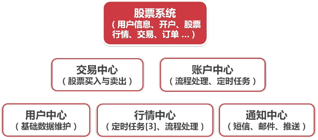
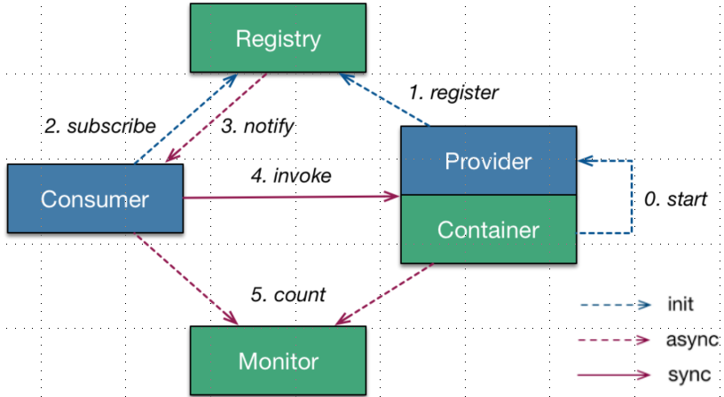

# 第13章 高并发之应用拆分思路

参考博客[JAVA并发编程与高并发解决方案 - 视频第14章（高并发之应用拆分思路）](https://blog.csdn.net/csdnlijingran/article/details/83279634)

## 1 概述

一个服务器再怎么优化，其处理能力都是有限的。之前介绍过过扩容、缓存机制、消息队列等优化方案，都是十分有效的。根据项目情况，将一个整体应用拆分为多个应用也不失为一个方案。比如按功能模块及功能模块使用频率拆分。

例子如下：

### 应用拆分的好处

+ 1、减轻并优化了整个统一的应用的压力。
+ 2、拆分后的应用可以被更精准的监控。
+ 3、不同子应用会更容易管理及局部优化。
+ 4、更利于功能模块内部的团队协作。

### 应用拆分的弊端

+ 1、管理的复杂度上升。
+ 2、代价昂贵。使用资源的成本增加。
+ 3、网络开销增加，带宽要求增加。

### 应用拆分的基本原则

+ 1、业务优先。优先按照业务的功能拆分为小应用。
+ 2、循序渐进，迭代拆分并进行测试。
+ 3、兼顾技术：重构、分层。
+ 4、可靠测试。减少或避免累积错误的出现。

### 应用拆分的思考

+ 1、应用之间通信：`RPC(dubbo等)`或`消息队列`(适用于传输数据包小，但传输量大，对数据的实时性要求不高的场景)
+ 2、应用之间的数据库设计：每个应用都应有自己的数据库，其中一些共同的信息可以另建一个公共数据库来存放
+ 3、避免事务操作跨应用，降低耦合度

## 2 服务化的Dubbo

Dubbo也是一种`分布式的服务框架`，可实现`软负载均衡`。  
但Dubbo Service不是分布式的服务框架，但可以结合其他组件实现负载均衡。  
Dubbo还提供了`监控中心`(可选，需要单独配置)和`调用中心`。  

其处理流程原理图如下：

其中的`Registey`模块选择`zookeeper`

服务端`Provider`通常会声明一个`Java接口类`来代表自己提供的服务。当消费端Consumer获得接口并配置完相应的内容后，会调用相应的接口方法，底层实际就对应着`invoke()方法调用服务`，并将`结果封装`为`接口定义的类型`返回。

## 3 微服务

`微服务`是一个`架构概念`。**通过功能分解，对解决方案解耦，并提供更加灵活的服务支持**。它可扩展单个组件，而不是整个应用程序堆栈，从而满足服务等级协议。它围绕着业务领域来创建应用，该应用可独立地进行开发、管理、迭代。在分散的组件中，使用云架构和平台式管理、部署和服务功能，使产品交付更加简单。它的`本质是通过使用功能明确、业务精炼的服务，去解决更大更实际的问题`。

微服务处理流程图如下：

### 微服务特点

+ 1、每个微服务独立地组成整个大服务
+ 2、单独部署。
+ 3、分布式地进行管理。
+ 4、强调隔离性。

### 实现隔离化的标准：

+ （1）是由分布式服务组成的系统；
+ （2）按照业务划分组织；
+ （3）其为有生命的产品；
+ （4）强服务个体，弱通信；
+ （5）自动化运维；
+ （6）具有高度的容错性；
+ （7）可快速演化迭代；

### 应用微服务需解决的问题

#### 1、客户端如何访问这些服务？

通过客户端与产品服务之间的一个访问代理：API Gateway，提供统一的服务入口，让微服务对前台透明；同时可以聚合后台的产品服务，节省流量，提升性能；提供安全、过滤、流控等API的管理功能。

#### 2、每个服务之间是如何通信的？

+ 若采用异步方式，则使用消息队列实现，如Kafka；
+ 若采用同步方式，则包括：REST和RPC。其中REST可通过SpringBoot或JAX-RS；RPC通常使用Dubbo；

#### 同步方式与异步方式的区别：

+ 同步调用 较为简单，一致性强；但当调用层次深时，易出现调用问题；REST是基于http协议，可跨客户端，更易实现，更加灵活（无语言限制）；RPC优点：传输协议更高效，安全更可控。
+ 异步消息 方式在分布式系统中有更加广泛的应用，既能减少调用之间的耦合，又能成为调用之间的缓存，确保消息积压不会冲垮被调用方；同时仍可保证调用方的体验，并继续自己的任务而不至于被后台的性能拖慢。但它的一致性较弱，需要接受数据的最终一致性，并由后台服务实现幂等性。需独立引入一个Broker。

#### 3、如此多的服务是如何实现的？

在微服务架构中，都是有多个拷贝以实现负载均衡。一个服务随时可能下线，也可能因应对访问压力，随时增加新的服务节点。

通过Zookeeper或其他类似功能实现服务之间的发现功能，做服务注册等信息的分布式管理。当服务上线时，服务启用者将将自己的服务信息注册至Zookeeper，并通过心跳维持长连接，并实时更新连接信息；服务调用者通过Zookeeper来寻找地址，根据可定制的算法，找到一个服务，还可以将服务信息缓存至本地，提高性能。当服务上线后，Zookeeper会通知给服务的客户端。

#### 4、若一个服务崩溃了该如何解决？

由于分布式最大的特性就是网络是非可靠的。通过微服务拆分，它可以降低网络不可靠带来的风险，但仍需要一定的安全保障。采取相应的手段降低服务调用链中的连环失效：重试机制、应用的限流、熔断机制、负载均衡、系统降级等。（后续会对其做更详细的手记。）
